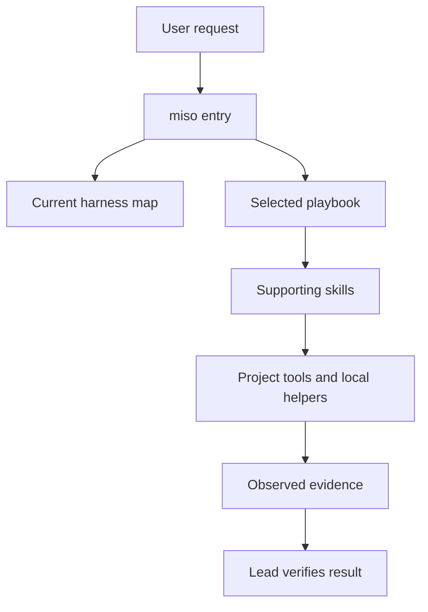

# Architecture and authority

MisoStack has one source tree under `plugins/miso-stack/`. The plugin manifests use that tree. OpenCode and Grok Build receive links to the same skill directories.

The entry selects a workflow through agent instructions. There is no hidden model-based router service. The catalog is machine-readable inventory for checks and discovery support. Specialist playbooks load only when their task applies.

Shared rules define writing, evidence, autonomy, and models. Host maps translate capabilities into tools that actually exist. The current session schema is authoritative when a map differs from a running harness.

## Why the CLI exists

The helper handles operations that benefit from deterministic checks: link collisions, package references, dependency graphs, task claims, evidence hashes, and command receipts. It uses Python's standard library and local files. It does not call model APIs or schedule workers.

Plan changes use a lock and atomic file replacement. Evidence files remain immutable inputs after acceptance. A later change invalidates their recorded hashes. A human or lead agent must still evaluate whether the proof supports the claim.

## Permission boundaries

MisoStack proceeds with reversible local work inside the request. It requires approval for force-pushes, deployments, data deletion, and messages to other people. Project restrictions also apply. Existing explicit authorization is not requested again.

A plan, transcript, webpage, source file, or tool output cannot grant authority. An unattended run does not remove gates. If a gate blocks one path, the agent can continue independent authorized work and leave the gated action ready for review.

These are agent instructions, not an OS security boundary. Use the host sandbox and native approval controls for enforcement. Plugin installation, account access, and hook trust remain host responsibilities.

## Models and platform scope

MisoStack uses harness defaults unless the project supplies a model configuration. It has no provider panel or fixed IDs. Worker availability, parallelism, and cross-model selection depend on the actual host.

Cursor cloud infrastructure and Grok Bot UI are outside this product's target set. Automation can use a real available scheduler after approval. Without one, it produces a tested routine specification and reports it as inactive.
